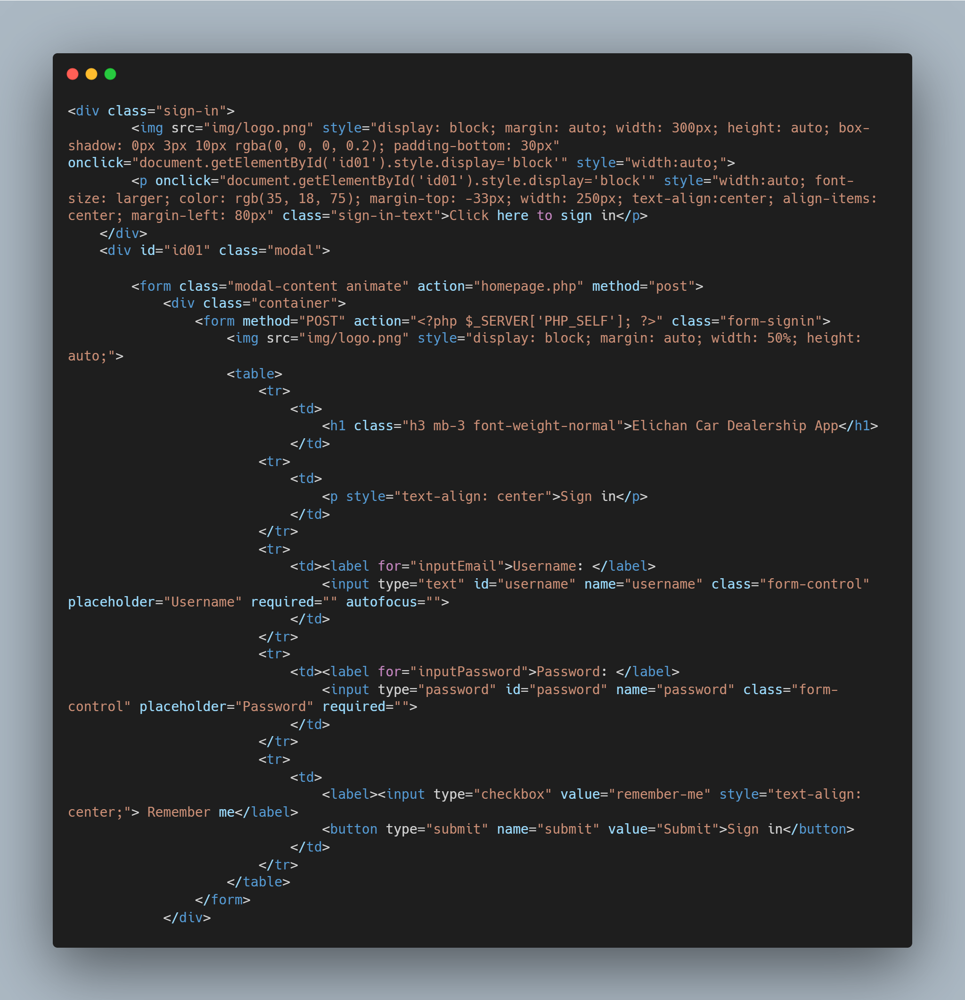

  
 <h1> EliChan Car Dealership </h1>
    
 
 [EliChan Car Dealership](https://github.com/xchan344/Elichan-cardealership-app) is a Sales and Transaction Tracking System that is developed by [Christian Dela Gente](https://github.com/xchan344) and [Elizalde Ulson II](https://github.com/NgtzBogz)
 
 <h2> System Features </h2>

- **Sign in & Sign out** - The user can Sign in and Sign out using Registered accounts into the system. this is a security feature to prevent unregistered users from accessing the system.

- **CRUD** - The system has CRUD features:
    1. Create - The user can Add Employee Data, Transaction Data, and Car Data into the system.
    2. Read - The user can view the data from the system's database in the System's webpage.
    3. Update - The user can make changes on the existing data in the databese using this system.
    4. Delete - The user can remove existing data that is irrelevant in the current database.

   
- **Sales Calculation** - The user can view the Total Earnings, Total Sales Earnings, Total repair earnings, and Total consult earnings on the top side of the system.

- **Bar Graph Visualization** - The user can view Transaction data in the form of graphs to help better visualize the information.

- **Filter** - The user can filter results so that they can better search for specific Data results.

### Visuals

*The Line of code above is the Sign In Feature, It shows how the system displays the Sign in Portion using Php, HTML, and Javascript.*

   

*The Line of code above is the Add Feature for the Cars Data, It shows how the system Adds New Data into the Cars Database using Php and HTML.*

   

*The Line of code above is the Delete Feature for the Cars Data, It shows how the system Deletes Existing Data from the Cars Database using Php.*

   

*The Line of code above is the Edit Feature for the Cars Data, It shows how the system Edit Existing Data from the Cars Database using Php and HTML.*

  

*The Line of code above is the Add Feature for the Employee Data, It shows how the system Adds New Data into the Employee Database using Php and HTML.*

   

*The Line of code above is the Delete Feature for the Employee Data, It shows how the system Deletes Existing Data from the Employee Database using Php.*

   

*The Line of code above is the Edit Feature for the Employee Data, It shows how the system Edit Existing Data from the Employee Database using Php and HTML.*

   

*The Line of code above is the Add Feature for the Transaction Data, It shows how the system Adds New Data into the Transaction Database using Php and HTML.*

   

*The Line of code above is the Delete Feature for the Transaction Data, It shows how the system Deletes Existing Data from the Transaction Database using Php.*

   

*The Line of code above is the Edit Feature for the Transactionn Data, It shows how the system Edit Existing Data from the Transaction Database using Php and HTML.*

   

*The image above shows the Sign In Page*

   

*The image above shows the Home Page*

   

*The image above shows the Employee Page*

   

*The image above shows the Transaction Page*

   

*The image above shows the Car Model Page*

   

# Installation

1. Fork the Repository From [xchan344](https://github.com/xchan344/Elichan-cardealership-app) github repositories
2. Import the elichan-cardealership-app.sql database using MySQL
3. Edit the db file in the config folder using VSCode
4. Open Wampserver or xamppserver
5. Run the App using the Wampserver or xamppserver's adminer
6. Enjoy the App

### Requirement:

- [Wampserver](https://www.wampserver.com/en/download-wampserver-64bits/) or [xamppserver](https://www.apachefriends.org) - for running PHP and MySQL

1. Download Wampserver or xamppserver from the provided link
2. Run the installer
3. Follow the installation guide from the installer
4. Finish the installation

  

- [PHP](https://www.php.net/downloads) - for using the PHP Programming Language

1. Download PHP from the provided Link
2. Extract the downloaded file
3. Copy the Extracted File's Path from the File Explorer's Address Bar
4. Open the System Environment Variables in the Control Panel and Edit it
5. Click Path and Edit
6. Click New then add the Extracted File's Path then press Ok
7. Open Command Prompt and type php --version to confirm the installation

  

- [MySQL](https://www.mysql.com/downloads/) - For Creating and Editing Database

1. Download MySQL Installer from the provided link
2. Run the installer and Accept License Agreement
3. Select Developer's Default or Full on Setup Type then click Next
4. Select all the Products and Features then click Next
5. click Execute to Download and Install Selected Products and Features then Click Next
6. Select Standalone MySQL Server then click Next
7. Select Development Computer in Config Type then click Next
8. Select "Use Strong Password Encryption for Authentication" in Authentication Method then click Next
9. Type a Password for the root user then click Next
10. Leave the Window Service into default then click Next
11. Execute the Apply Configuration then Click Next
12. Finish the Installation

   

- [VSCode](https://code.visualstudio.com) - for Coding

1. Download the VSCode Installer from the provided Link
2. Run the Installer 
3. Accept the License Agreement then click Next
4. Select a File Destination Locartion then click Next
5. Select a Start Menu Folder then Click Next
6. Select Additional Tasks then Click Next
7. Click Install and Wait for it to finish
8. Finish the Installation

   

# Usage

The EliChan Car Dealership app can be used in a number of ways: 

- **Sales Tracking** - with the App, the user can accurately see how much they've sold and gained visually by seeing the Graphs and Sales Calculation
- **Employee Handling** - with the App, the user can easily manage the employees by making adding, deleting, and editing Employees Simple using CRUD
- **Transaction Tracking** - with the App, the user can easily Track the number of Transactions they have done, they can also filter them so that they can easily look for a specific transaction easily.

   

# Support

For Questions and Further Assistance, you can Contact us using

- Christian Dela Gente - 201440553@psu.palawan.edu.ph / [xchan344](https://github.com/xchan344) 
- Elizalde Ulson II - 201980044@psu.palawan.edu.ph / [NgtzBogz](https://github.com/NgtzBogz)

   

# Authors and Acknowledgements

## [Christian Dela Gente](https://github.com/xchan344)

   

## [Elizalde Ulson II](https://github.com/NgtzBogz)

   

# License 

**MIT License**

Copyright (c) [2023] [Christian Dela Gente & Elizalde Ulson II]

Permission is hereby granted, free of charge, to any person obtaining a copy
of this software and associated documentation files (the "Software"), to deal
in the Software without restriction, including without limitation the rights
to use, copy, modify, merge, publish, distribute, sublicense, and/or sell
copies of the Software, and to permit persons to whom the Software is
furnished to do so, subject to the following conditions:

The above copyright notice and this permission notice shall be included in all
copies or substantial portions of the Software.

THE SOFTWARE IS PROVIDED "AS IS", WITHOUT WARRANTY OF ANY KIND, EXPRESS OR
IMPLIED, INCLUDING BUT NOT LIMITED TO THE WARRANTIES OF MERCHANTABILITY,
FITNESS FOR A PARTICULAR PURPOSE AND NONINFRINGEMENT. IN NO EVENT SHALL THE
AUTHORS OR COPYRIGHT HOLDERS BE LIABLE FOR ANY CLAIM, DAMAGES OR OTHER
LIABILITY, WHETHER IN AN ACTION OF CONTRACT, TORT OR OTHERWISE, ARISING FROM,
OUT OF OR IN CONNECTION WITH THE SOFTWARE OR THE USE OR OTHER DEALINGS IN THE
SOFTWARE.
